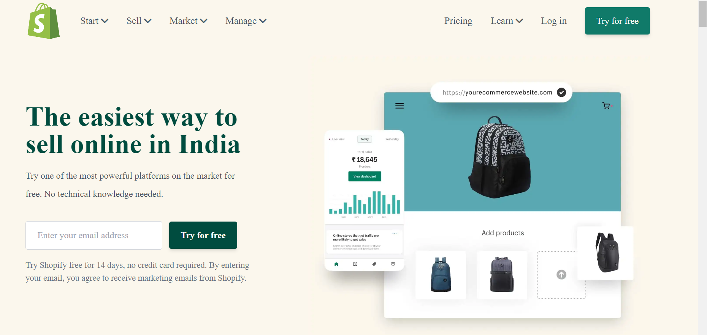

# Shopify clone

# **Project-shopifyclone** [LIVE LINK](https://shopifyc-lone.netlify.app/)
>- Skills gained in this project
 >- learned about talwind css
 >- learned about how to make responsivness any webiste
 >- learned abour grid and flexbox
 
 ***
 **Time taken to finish to this project**
 
 >-It took me 7 hour to complete this project 

 **Screenshot**
 